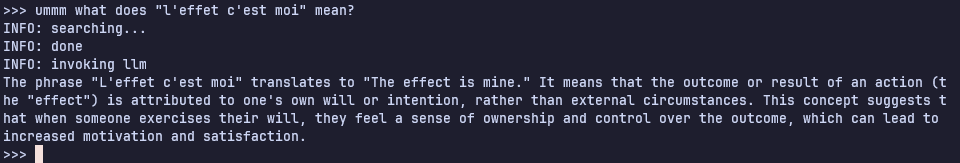

# encephalon

a RAG-based ([retrieval-augmented generation](https://en.wikipedia.org/wiki/Retrieval-augmented_generation)) knowledge database.

### introduction

**Encephalon** is inspired by the idea of a "Second Brain" which is an
external, centralized, digital repository for the things you learn and
the resources from which they come. A Second Brain ultimately expands
our memory and our intellect using modern tools of technology.

#### what is RAG?

Retrieval-Augmented Generation (RAG) is a technique that grants generative
artificial intelligence models information retrieval capabilities. It modifies
interactions with a large language model (LLM) so that the model responds to
user queries with reference to a specified set of documents, using this
information to augment information drawn from its own vast, static training
data. This allows LLMs to use domain-specific and/or updated information.
Use cases include providing chatbot access to internal company data or giving
factual information only from an authoritative source.

### concept

encephalon works in the following stages:

+ ingestion: the ingestion pipeline parses and processes data from various formats that one
might consume. currently, it supports PDFs, EPUBs, text files, and YouTube
links.

+ embedding: the processed data is then tokenized, and
[vector embeddings](https://www.ibm.com/think/topics/vector-embedding)
of these tokens are stored in a database along with metadata.

+ retrieval: when queried, the search terms have to be vectorised, and then a
vector-to-vector similarity search is performed.

+ augmentation: a prompt with the original query and the retrieved data from the
  stored documents is engineered and fed to a locally running LLM.

+ generation: finally, the LLM can generate output that is fine-tuned by the
retrieved documents.

### setup

+ clone git repo:

```console
git clone https://github.com/samarthkulshrestha/encephalon.git
cd encephalon
```

+ `encephalon` stores cached data and the vector database in:
    1. `$XDG_DATA_HOME/encephalon`
    2. `~/.local/share/encephalon`

+ create the cache directory structure:

```console
chmod +x makecache.sh
./makecache.sh
```

+ create a virtual environment

```console
python3 -m venv venv
source ./venv/bin/activate
```

+ install dependencies:

```console
pip3 install -r requirements.txt
```

### usage

+ run without any arguments to launch into the LLM. type `bye` to exit:

```console
./bin/encephalon
```

+ add data to `knowledge` using:

```console
./bin/encephalon --youtube <link>       # shorthand -y
./bin/encephalon --pdf <file>           # shorthand -p
./bin/encephalon --epub <file>          # shorthand -e
./bin/encephalon --txt <file>           # shorthand -t
```

+ to perform just a vector search on the knowledge database (without LLM generation):

```console
./bin/encephalon --search "<query>"     # shorthand -s
```

+ run `./bin/encephalon -h` for more help.

### screenshot



### contribute

+ i <3 pull requests and bug reports!
+ don't hesitate to [tell me my code-fu sucks](https://github.com/samarthkulshrestha/encephalon/issues/new), but please tell me why.

### license

this project is licensed under the MIT License.

Copyright (c) 2025 Samarth Kulshrestha.

